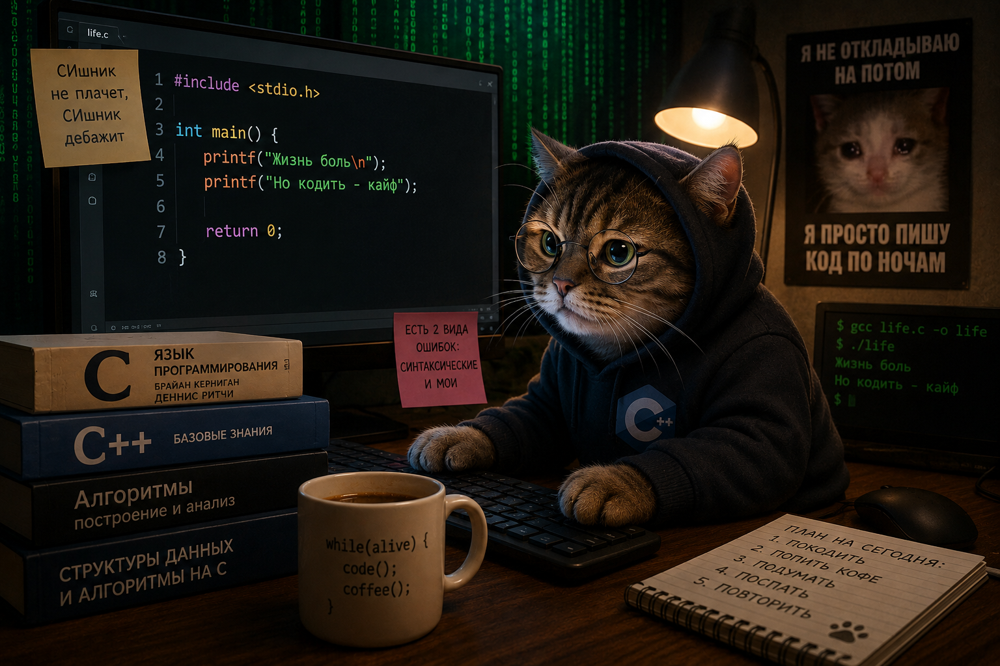

# 📘 C/C++ Programming Labs — 1 Well


# 👨‍💻 Автор
## Лёшин Артём ИКС-532 студент 1 курса
Репозиторий с лабораторными работами, практическими заданиями и РГР по дисциплине программирования на C/C++ за 1 семестр.


---

# 📂 Структура проекта

```text
.
├── debugger
├── lab01
├── lab02
├── lab03
├── lab04
├── lab05
├── lab06
├── lab07
├── lab08
├── lab09
├── lab10
├── lab12
├── lab13
├── lab14
├── lab15
├── lab16
├── lab17
├── lab18
├── lab19
├── RGR
├── README.md
└── C_Cpp.gitignore
```

---

# 📚 Лабораторные работы

| Директория | Тема |
|---|---|
| `lab01` | Ввод с клавиатуры и условия |
| `lab02` | Циклы |
| `lab03` | Функции (часть 1) |
| `lab04` | Битовые операции |
| `lab05` | Массивы, строки, матрицы |
| `lab06` | Указатели и динамическая память |
| `lab07` | Функции (часть 2). Указатели |
| `lab08` | Препроцессор |
| `lab09` | Git |
| `lab10` | Структуры, объединения, перечисления |
| `debugger` | Отладка программ|
| `lab12` | Многофайловые проекты и библиотеки |
| `lab13` | Системы сборки Make и CMake |
| `lab14` | Связанные списки и сложность алгоритмов |
| `lab15` | Текстовые и бинарные файлы |
| `lab16` | Многопоточные программы |
| `lab17` | Тестирование ПО и качество кода |
| `lab18` | C++ |
| `lab19` | Вайбкодинг |
| `RGR` | Расчётно-графическая работа |

---

# 🚀 Сборка и запуск

## Компиляция через GCC/G++

```bash
g++ main.cpp -o app
./app
```

## Сборка через CMake

```bash
mkdir build
cd build

cmake ..
cmake --build .

./app
```

---


