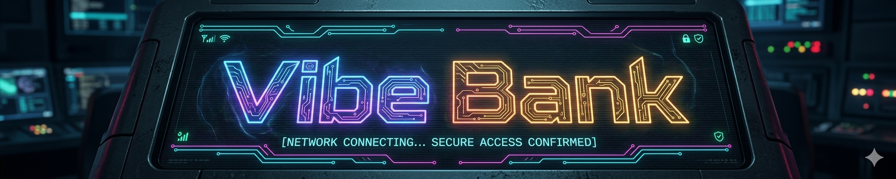

# 💀 VibeBank 2077: Neural Core

Добро пожаловать в **VibeBank 2077** — высокотехнологичную банковскую экосистему. Мы 
обеспечиваем максимальный уровень вайба и безопасность ваших кредитов через нейро-ядро банкомата.


---

## 🛠 Архитектура системы
* **Neural Core (ATMEngine)**: Управляет сессиями и доступом.
* **Persistent Storage (FileStorage)**: Бинарное хранилище вашего баланса (`acc.dat`).
* **Journaling**: Логирование всех операций в реальном времени.
* **Security Protocol**: Защита от брутфорса (блокировка карты после 3-х попыток).

---

## 🚀 Быстрый старт
Убедитесь, что у вас установлены `cmake` и `g++`.

1. **Дайте права на выполнение скрипту:**
   ```bash
   chmod +x start.sh
   ```
## ⚙️ Управление системой
1. Запуск   
    ```bash
    ./start.sh
    ```
2. Экстренное обнуление (Hard Reset)
    ```bash
    rm -f acc.dat journal.bin && rm -rf build
    ```

## 🔐 Доступ и Безопасность
Система VibeBank 2077 работает с фиксированным профилем пользователя. Регистрация новых аккаунтов в текущей версии ядра (1.0.0) недоступна.

    Стандартный PIN-код: 1111

    Идентификатор карты: 1234-5678-9012-3456

    Техническая справка: Данные пользователя инициализируются при первом запуске через file_storage.cpp. Если вам нужно изменить владельца карты или PIN, вы можете сделать это напрямую в исходном коде в методе инициализации аккаунта.
## 📂 Структура проекта
```text
.
├── account.h/cpp      # Модель данных пользователя (баланс, лимиты)
├── atm_engine.h/cpp   # Основной движок: меню, логика сессии, авторизация
├── card.h/cpp         # Логика работы с картой и проверка PIN-кода
├── file_storage.h/cpp # Модуль ввода-вывода данных в файл (acc.dat)
├── journal.h/cpp      # Система логирования (история операций)
├── recovery.h/cpp     # Протокол восстановления данных при запуске
├── transaction.h/cpp  # Структуры и типы данных для транзакций
├── main.cpp           # Точка входа в программу
├── CMakeLists.txt     # Конфигурация сборки проекта
├── start.sh           # Загрузчик: инициализация, логотип, компиляция
└── README.md          # Документация проекта

```

## 👤 Разработчик
Проект создан для лаборатории №19.
* **Developer**: Artem Lesin
* **Neural Core Version**: 1.0.0
* **Location**: CyberSpace, 2077